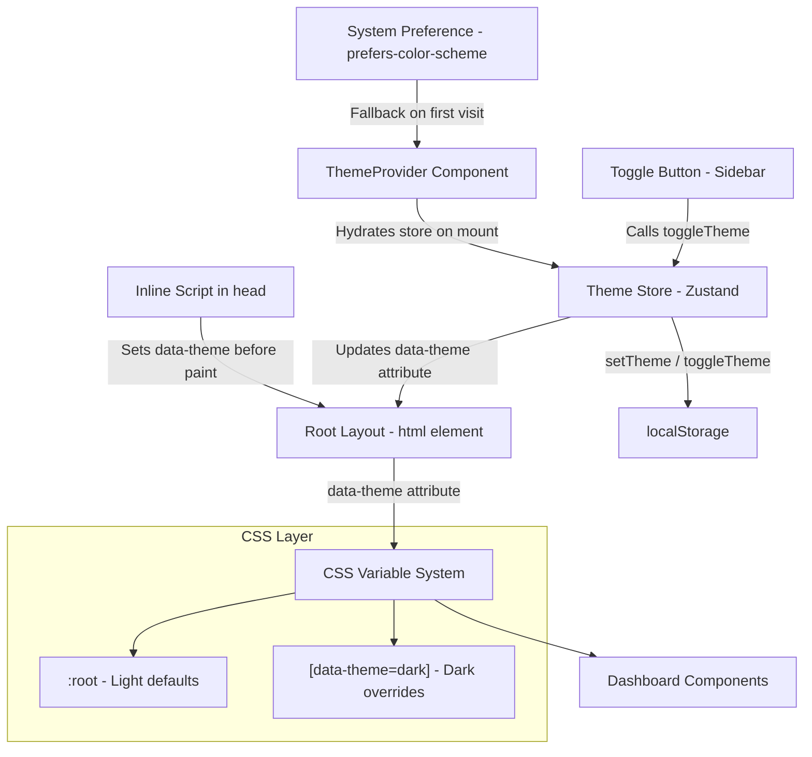

# Design Document: Dark Mode Toggle

## Overview

This design introduces a dark/light mode toggle to the OmniLaunch dashboard. The current application uses a light-only theme defined via CSS custom properties in `globals.css`. This feature adds:

1. A dedicated Zustand store slice (`themeStore`) managing theme state with localStorage persistence
2. A `ThemeProvider` component that initializes the theme before first paint (preventing FOIT)
3. A `[data-theme="dark"]` CSS variable override system for seamless theming
4. A toggle switch in the Sidebar with accessible markup
5. Smooth 200ms CSS transitions between themes

The design leverages the existing CSS custom property architecture — all dashboard components already reference variables like `--bg-surface`, `--text-primary`, etc. By overriding these variables under a `[data-theme="dark"]` selector, the entire UI adapts without modifying individual component styles.

## Architecture



### Key Architectural Decisions

1. **`data-theme` attribute on `<html>` instead of a CSS class**: Using a data attribute provides a clear semantic signal and avoids class name collisions. The `[data-theme="dark"]` selector is explicit and self-documenting.

2. **Inline blocking script for FOIT prevention**: A small inline script in `<head>` reads localStorage and sets `data-theme` before React hydrates. This prevents a flash of the wrong theme on page load.

3. **Separate `themeStore` rather than extending `appStore`**: Theme state is orthogonal to app/auth state. A dedicated store keeps concerns separated and makes the theme logic independently testable.

4. **CSS transitions with a `no-transition` guard**: On initial load, a `no-transition` class prevents the 200ms fade. It's removed after the first paint via `requestAnimationFrame`.

## Components and Interfaces

### 1. Theme Store (`src/stores/themeStore.ts`)

```typescript
type Theme = "dark" | "light";

interface ThemeState {
  theme: Theme;
  setTheme: (theme: string) => void;
  toggleTheme: () => void;
}
```

**Behavior:**
- `theme` defaults to `"light"` when no valid localStorage value exists
- `setTheme(value)` validates input — only `"dark"` or `"light"` are accepted; invalid values are ignored
- `toggleTheme()` flips `"dark"` ↔ `"light"`
- Both actions persist the new value to `localStorage` under key `"omnilaunch_theme"`
- On store creation, reads from localStorage and validates

### 2. Theme Provider (`src/components/ThemeProvider.tsx`)

```typescript
interface ThemeProviderProps {
  children: React.ReactNode;
}
```

**Responsibilities:**
- Client component that mounts in the root layout
- On mount: reads localStorage → falls back to `prefers-color-scheme` → defaults to `"light"`
- Syncs the resolved theme into the Zustand store
- Applies `data-theme` attribute to `document.documentElement`
- Removes the `no-transition` class after first paint

### 3. Inline Theme Script (`src/app/layout.tsx` — injected in `<head>`)

A small inline `<script>` that runs before React:

```javascript
(function() {
  var stored = null;
  try { stored = localStorage.getItem('omnilaunch_theme'); } catch(e) {}
  var theme = (stored === 'dark' || stored === 'light')
    ? stored
    : (window.matchMedia('(prefers-color-scheme: dark)').matches ? 'dark' : 'light');
  document.documentElement.setAttribute('data-theme', theme);
  document.documentElement.classList.add('no-transition');
})();
```

### 4. Toggle Button (within `src/components/dashboard/Sidebar.tsx`)

**Expanded state:** Renders "Light" label, a switch track with sliding indicator, and "Dark" label.

**Collapsed state:** Renders a single icon button — Moon (dark active) or Sun (light active).

**Accessibility:**
- `role="switch"`
- `aria-checked={theme === "dark"}`
- `aria-label="Toggle dark mode"`
- Responds to Enter and Space key presses

### 5. CSS Variable Overrides (`src/app/globals.css`)

The existing `:root` block defines light theme values. A new `[data-theme="dark"]` block overrides all surface, text, border, and shadow variables.

## Data Models

### Theme State

| Field | Type | Storage | Description |
|-------|------|---------|-------------|
| `theme` | `"dark" \| "light"` | Zustand + localStorage | Current active theme |

### localStorage Schema

| Key | Value | Description |
|-----|-------|-------------|
| `"omnilaunch_theme"` | `"dark"` or `"light"` | Persisted user preference |

### DOM State

| Element | Attribute | Values | Description |
|---------|-----------|--------|-------------|
| `<html>` | `data-theme` | `"dark"`, `"light"` | Controls CSS variable resolution |
| `<html>` | `class` | includes `no-transition` | Suppresses transitions on initial load |

## Correctness Properties

*A property is a characteristic or behavior that should hold true across all valid executions of a system — essentially, a formal statement about what the system should do. Properties serve as the bridge between human-readable specifications and machine-verifiable correctness guarantees.*

### Property 1: setTheme validates input

*For any* string value, calling `setTheme(value)` SHALL update the store's `theme` property to `value` if and only if `value` is exactly `"dark"` or `"light"`; otherwise the `theme` property SHALL remain unchanged.

**Validates: Requirements 1.2, 1.3**

### Property 2: toggleTheme is an involution

*For any* valid theme state (either `"dark"` or `"light"`), calling `toggleTheme()` twice SHALL return the store's `theme` property to its original value.

**Validates: Requirements 1.4**

### Property 3: Persistence round-trip

*For any* sequence of valid `setTheme` and `toggleTheme` operations on the Theme_Store, the value stored in `localStorage` under key `"omnilaunch_theme"` SHALL always equal the store's current `theme` property.

**Validates: Requirements 1.5, 6.1**

### Property 4: Initialization validation

*For any* string stored in `localStorage` under key `"omnilaunch_theme"`, the Theme_Store SHALL initialize its `theme` property to that string if it is exactly `"dark"` or `"light"`, and SHALL default to `"light"` otherwise.

**Validates: Requirements 1.6, 2.3, 6.4**

## Error Handling

### localStorage Unavailable

When `localStorage.getItem()` or `localStorage.setItem()` throws (e.g., private browsing, storage quota exceeded):
- **Read failures**: The ThemeProvider falls back to `prefers-color-scheme` media query, then to `"light"`.
- **Write failures**: The store updates in-memory state normally but silently swallows the persistence error. The theme works for the current session but won't persist across page reloads.

### Invalid Stored Values

If `localStorage` contains a value other than `"dark"` or `"light"` for the `"omnilaunch_theme"` key (e.g., corrupted data, manual tampering):
- The value is discarded.
- The system falls back to `prefers-color-scheme`, then to `"light"`.

### matchMedia Unavailable

If `window.matchMedia` is not available (older browsers, SSR):
- The system defaults to `"light"`.

### Invalid data-theme Attribute

If the `data-theme` attribute is set to an unsupported value via external manipulation:
- CSS naturally falls back to `:root` (light theme) values since only `[data-theme="dark"]` has overrides.

## Testing Strategy

### Property-Based Tests (fast-check)

The project already includes `fast-check` as a dev dependency. Property-based tests will validate the four correctness properties above.

**Library**: `fast-check` (already in `package.json` devDependencies)
**Runner**: Vitest or Jest (to be added if not present)
**Minimum iterations**: 100 per property

Each property test will be tagged with:
```
// Feature: dark-mode-toggle, Property {N}: {property_text}
```

**Test file**: `src/stores/__tests__/themeStore.property.test.ts`

Property tests cover:
1. `setTheme` input validation across arbitrary strings
2. `toggleTheme` involution (double-toggle identity)
3. localStorage persistence consistency after arbitrary operation sequences
4. Store initialization with arbitrary localStorage values

### Unit Tests (Example-Based)

**Test file**: `src/stores/__tests__/themeStore.test.ts`

- Default theme is `"light"` when localStorage is empty
- `setTheme("dark")` updates theme to `"dark"`
- `toggleTheme` switches `"dark"` → `"light"` and `"light"` → `"dark"`
- Store reads valid value from localStorage on init

**Test file**: `src/components/__tests__/ThemeProvider.test.tsx`

- Applies `data-theme="dark"` when localStorage has `"dark"`
- Falls back to system preference when localStorage is empty
- Falls back to `"light"` when both localStorage and matchMedia are unavailable
- Handles localStorage errors gracefully

**Test file**: `src/components/dashboard/__tests__/Sidebar.toggle.test.tsx`

- Toggle button renders with `role="switch"` and correct `aria-checked`
- Click toggles theme
- Enter/Space key activates toggle
- Expanded sidebar shows labels; collapsed shows icon only

### Integration Tests

- CSS contrast ratio verification for dark theme variables (automated with a script that parses computed styles)
- Visual regression snapshots for both themes (optional, via Playwright or Storybook)

### Smoke Tests

- Inline script is present in rendered HTML `<head>`
- `[data-theme="dark"]` selector exists in compiled CSS
- No hardcoded color literals in dashboard component source files (linting rule)

