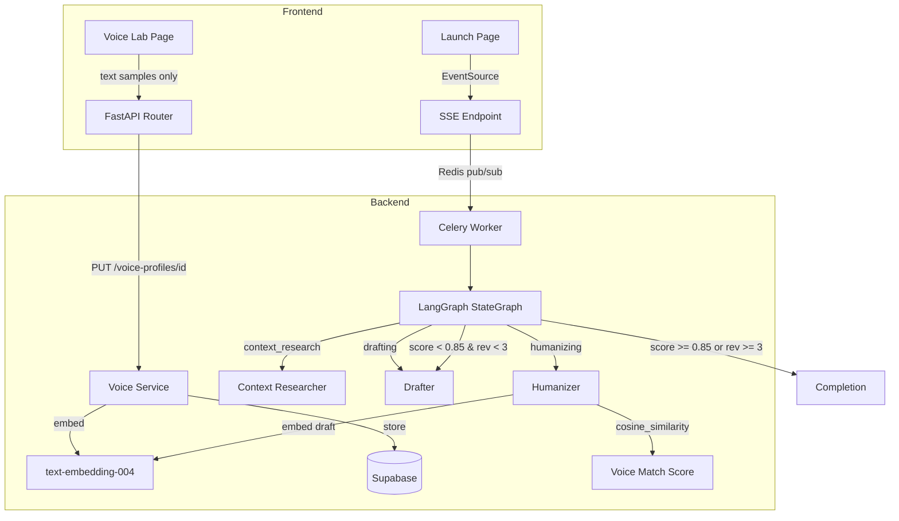

# Design Document: Early Phase Gaps

## Overview

This design addresses five implementation gaps in the OmniLaunch project's earlier phases. Each subsystem is partially scaffolded but missing key functionality:

1. **Voice Lab UI** — Currently supports both URL and text sample types with up to 10 samples. Needs simplification to text-only with a 5-sample cap.
2. **Voice Profile PUT Endpoint** — The router has GET, POST, DELETE but no PUT for updating profiles with new samples.
3. **Frontend SSE Consumption** — The backend SSE endpoint exists and works, but the frontend Launch page uses polling instead of EventSource.
4. **LangGraph Agent Pipeline** — The current `graph.py` uses a manual async loop with sequential agent calls. Needs migration to LangGraph's StateGraph with conditional edges and cycles.
5. **Embedding-Based Voice Match Scoring** — The humanizer uses a heuristic scorer. Needs replacement with cosine similarity between text-embedding-004 vectors.

## Architecture



The architecture preserves the existing FastAPI + Celery + Redis stack. LangGraph replaces the manual orchestration loop. The embedding model is called in two places: during voice profile creation/update (to store the style embedding) and during humanizer scoring (to embed the draft for comparison).

## Components and Interfaces

### 1. Voice Lab UI (Simplified)

**File:** `frontend/src/app/(dashboard)/dashboard/voice-lab/page.tsx`

**Changes from current implementation:**
- Remove the `<select>` type dropdown (currently allows "text" or "url")
- Remove URL input rendering branch
- Change max samples from 10 to 5
- Add "Paste samples of your writing below" label
- Force all samples to `type: "text"` on submission

**Interface:**
```typescript
// Internal state — simplified
const [samples, setSamples] = useState<string[]>(['']);

// On submit, map to API format
const payload = samples
  .filter(s => s.trim().length > 0)
  .map(s => ({ type: 'text', value: s }));
```

### 2. Voice Profile PUT Endpoint

**File:** `backend/app/routers/voice.py`

**New endpoint:**
```python
@router.put("/voice-profiles/{profile_id}", response_model=VoiceProfileResponse)
async def update_voice_profile(
    profile_id: str,
    req: UpdateVoiceProfileRequest,
    user: dict = Depends(get_current_user),
) -> VoiceProfileResponse:
    ...
```

**New schema** (in `models/schemas.py`):
```python
class UpdateVoiceProfileRequest(BaseModel):
    samples: list[VoiceSample] = Field(min_length=1, max_length=20)
    name: str | None = None
```

**Flow:**
1. Verify profile exists → 404 if not
2. Verify profile belongs to user → 403 if not
3. Call `analyze_voice_samples(samples)` → new manifesto + confidence
4. Call `generate_style_embedding(combined_text)` → 768-dim vector
5. Update DB record with new manifesto, samples, embedding, confidence
6. Return updated profile

### 3. Frontend SSE Consumption

**File:** `frontend/src/app/(dashboard)/dashboard/launch/page.tsx`

**New hook:** `frontend/src/lib/hooks/useBundleSSE.ts`

```typescript
interface SSEEvent {
  platform: string;
  status: 'connected' | 'researching' | 'drafting' | 'humanizing' | 'complete' | 'failed' | 'stream_end';
  detail: string;
}

function useBundleSSE(bundleId: string | null, token: string | null): {
  events: SSEEvent[];
  isComplete: boolean;
  isFailed: boolean;
  error: string | null;
}
```

**Behavior:**
- Opens `EventSource` to `/api/v1/bundles/{id}/status?token={jwt}`
- Parses each `data:` line as JSON
- Updates local event list for UI rendering
- On `status: "complete"` → closes connection, signals caller to fetch bundle
- On `status: "failed"` → closes connection, surfaces error
- On EventSource `onerror` → closes connection, falls back to polling
- On unmount → closes connection via cleanup return

### 4. LangGraph Agent Pipeline

**File:** `backend/app/agents/graph.py` (rewrite)

**State schema:**
```python
from langgraph.graph import StateGraph, END
from typing import TypedDict, Annotated
from operator import add

class PipelineState(TypedDict):
    platform: str
    sub_target: str | None
    tone_manifesto: dict
    platform_constraints: dict
    product: dict
    current_draft: dict | None
    revision_count: int
    voice_match_score: float
    progress_callback: Any  # callable or None
    final_post: dict | None
```

**Graph structure:**
```python
graph = StateGraph(PipelineState)
graph.add_node("context_research", context_research_node)
graph.add_node("drafting", drafting_node)
graph.add_node("humanizing", humanizing_node)

graph.set_entry_point("context_research")
graph.add_edge("context_research", "drafting")
graph.add_edge("drafting", "humanizing")
graph.add_conditional_edges("humanizing", route_after_humanize, {
    "drafting": "drafting",
    "end": END,
})
```

**Routing function:**
```python
def route_after_humanize(state: PipelineState) -> str:
    if state["voice_match_score"] < 0.85 and state["revision_count"] < 3:
        return "drafting"
    return "end"
```

**Outer loop** (unchanged pattern): iterate over targets sequentially, invoke the compiled graph once per target, catch exceptions per-target.

### 5. Embedding-Based Voice Match Scoring

**File:** `backend/app/services/voice_service.py` (new function)

```python
async def generate_style_embedding(text: str) -> list[float]:
    """Generate a 768-dim embedding using text-embedding-004."""
    import google.generativeai as genai
    settings = get_settings()
    genai.configure(api_key=settings.gemini_api_key)
    result = genai.embed_content(
        model="models/text-embedding-004",
        content=text,
        task_type="SEMANTIC_SIMILARITY",
    )
    return result['embedding']  # 768-dim list[float]
```

**File:** `backend/app/agents/humanizer.py` (modified scoring)

```python
import numpy as np

def compute_cosine_similarity(vec_a: list[float], vec_b: list[float]) -> float:
    """Compute cosine similarity between two vectors."""
    a = np.array(vec_a)
    b = np.array(vec_b)
    dot = np.dot(a, b)
    norm_a = np.linalg.norm(a)
    norm_b = np.linalg.norm(b)
    if norm_a == 0 or norm_b == 0:
        return 0.0
    return float(dot / (norm_a * norm_b))

def normalize_cosine_to_score(cosine_sim: float) -> float:
    """Normalize cosine similarity from [-1, 1] to [0, 1]."""
    return (cosine_sim + 1.0) / 2.0
```

**Fallback logic:** If `style_embedding` is `None` on the voice profile (legacy profiles), the humanizer falls back to the existing `score_voice_match()` heuristic function.

## Data Models

### Updated Voice Profile (no schema change needed — column exists)

The `style_embedding VECTOR(768)` column already exists in the `voice_profiles` table. Currently it's always NULL. After this feature, it will be populated on create and update.

### New Pydantic Schema

```python
class UpdateVoiceProfileRequest(BaseModel):
    """Request body for PUT /voice-profiles/{id}."""
    samples: list[VoiceSample] = Field(min_length=1, max_length=20)
    name: str | None = None
```

### SSE Event Shape (unchanged)

```json
{
  "platform": "reddit" | "hackernews" | "all",
  "status": "connected" | "researching" | "drafting" | "humanizing" | "complete" | "failed" | "stream_end",
  "detail": "Human-readable message"
}
```

### LangGraph Pipeline State

```python
class PipelineState(TypedDict):
    platform: str
    sub_target: str | None
    tone_manifesto: dict
    platform_constraints: dict
    product: dict
    current_draft: dict | None       # {"title": str, "body": str}
    revision_count: int              # 0-3
    voice_match_score: float         # 0.0-1.0
    progress_callback: Any
    final_post: dict | None          # final humanized output
```

## Correctness Properties

*A property is a characteristic or behavior that should hold true across all valid executions of a system — essentially, a formal statement about what the system should do. Properties serve as the bridge between human-readable specifications and machine-verifiable correctness guarantees.*

### Property 1: Submission filters empty samples and forces text type

*For any* array of sample strings (including empty strings, whitespace-only strings, and non-empty strings), submitting the Voice Lab form SHALL produce a payload containing only the non-empty (trimmed) samples, each with `type: "text"`.

**Validates: Requirements 1.6**

### Property 2: Voice analysis produces a valid Tone Manifesto

*For any* non-empty list of text samples, running voice analysis SHALL produce a Tone Manifesto containing all required fields (`sentence_structure`, `avg_sentence_length`, `vocabulary_level`, `technicality_score`, `emoji_usage`, `formality`, `first_person_preference`, `forbidden_patterns`, `signature_phrases`) and a confidence score in [0.0, 1.0].

**Validates: Requirements 2.2**

### Property 3: SSE event parsing updates UI state correctly

*For any* valid SSE event with a known status value (`researching`, `drafting`, `humanizing`, `complete`, `failed`) and any platform string, parsing the event SHALL update the UI state to reflect that platform's current status.

**Validates: Requirements 3.2**

### Property 4: Humanizer routing decision is deterministic

*For any* `voice_match_score` in [0.0, 1.0] and `revision_count` in [0, ∞), the routing function SHALL return `"drafting"` if and only if `voice_match_score < 0.85` AND `revision_count < 3`; otherwise it SHALL return `"end"`.

**Validates: Requirements 4.2, 4.3**

### Property 5: Progress callback invoked for each node completion

*For any* target platform processed by the pipeline, the progress_callback SHALL be invoked with `(platform, status, detail)` at least once per node (context_research, drafting, humanizing) where `status` matches the node's phase name.

**Validates: Requirements 4.5**

### Property 6: Targets are processed in sequential order

*For any* list of N target platforms, the pipeline SHALL process them in order such that the i-th progress_callback sequence corresponds to `targets[i]`.

**Validates: Requirements 4.6**

### Property 7: Fault isolation across targets

*For any* list of targets where target at index `k` raises an exception, all targets at indices `> k` SHALL still be processed, and the failed target SHALL have status `"failed"` in the results.

**Validates: Requirements 4.7**

### Property 8: Cosine similarity computation and normalization

*For any* two valid 768-dimensional vectors, `compute_cosine_similarity` SHALL return a value in [-1.0, 1.0], and `normalize_cosine_to_score` SHALL map that value to [0.0, 1.0] using the formula `(cosine_sim + 1) / 2`.

**Validates: Requirements 5.4, 5.6**

### Property 9: Self-similarity identity (round-trip)

*For any* valid non-zero vector, computing `cosine_similarity(v, v)` SHALL produce 1.0 (within floating-point tolerance of 1e-7), and after normalization the voice_match_score SHALL be 1.0.

**Validates: Requirements 5.7**

## Error Handling

| Scenario | Handling |
|----------|----------|
| PUT to non-existent profile | Return 404 with `"Voice profile not found"` |
| PUT to another user's profile | Return 403 with `"Access denied"` |
| Embedding API failure during profile update | Log error, store profile without embedding (NULL), return success with warning |
| Embedding API failure during humanizer scoring | Fall back to heuristic `score_voice_match()` |
| EventSource connection error on frontend | Close EventSource, activate polling fallback (existing `pollBundle` logic) |
| SSE timeout (2.5 min) | Backend sends `stream_end` event; frontend treats as completion and fetches bundle |
| LangGraph node exception | Catch per-target, record `"failed"` status for that platform, continue remaining targets |
| Redis unavailable for SSE | Backend falls back to DB polling mode (already implemented in `sse.py`) |
| Empty samples array on PUT | Pydantic validation rejects with 422 (min_length=1) |
| Cosine similarity with zero vector | Return 0.0 score (guard against division by zero) |

## Testing Strategy

### Unit Tests (Example-Based)

- **Voice Lab UI**: Render tests verifying label text, textarea rendering, absence of type selector, max 5 samples, button hiding at limit
- **PUT endpoint**: Integration tests for 404/403 responses, successful update flow
- **SSE hook**: Tests for connection lifecycle (open, complete, failed, unmount cleanup, error fallback)
- **LangGraph structure**: Smoke test verifying graph has expected nodes and edges
- **Embedding fallback**: Test that None embedding triggers heuristic scorer

### Property-Based Tests

Property-based testing is appropriate for this feature because several subsystems involve pure functions with clear input/output behavior (cosine similarity, normalization, routing logic, sample filtering) and universal properties that hold across wide input spaces.

**Library:** [Hypothesis](https://hypothesis.readthedocs.io/) (Python) for backend properties, [fast-check](https://fast-check.dev/) (TypeScript) for frontend properties.

**Configuration:**
- Minimum 100 iterations per property test
- Each test tagged with: `Feature: early-phase-gaps, Property {N}: {title}`

**Property tests to implement:**

| Property | Target | Library |
|----------|--------|---------|
| P1: Submission filtering | Frontend (useBundleSSE hook / form logic) | fast-check |
| P2: Tone Manifesto validity | Backend (voice_service) | Hypothesis |
| P3: SSE event parsing | Frontend (event parser) | fast-check |
| P4: Routing decision | Backend (route_after_humanize) | Hypothesis |
| P5: Progress callback | Backend (pipeline integration) | Hypothesis |
| P6: Sequential processing | Backend (pipeline integration) | Hypothesis |
| P7: Fault isolation | Backend (pipeline integration) | Hypothesis |
| P8: Cosine similarity + normalization | Backend (humanizer math) | Hypothesis |
| P9: Self-similarity identity | Backend (humanizer math) | Hypothesis |

### Integration Tests

- End-to-end PUT flow: create profile → update with new samples → verify DB state
- SSE stream: start generation → verify events arrive → verify completion
- LangGraph pipeline: run with mocked agents → verify full flow produces posts

### Dependencies to Add

**Backend (`requirements.txt`):**
```
langgraph>=0.2.0
numpy>=1.26.0
```

**Frontend (`package.json`):**
```json
"devDependencies": {
  "fast-check": "^3.0.0"
}
```
