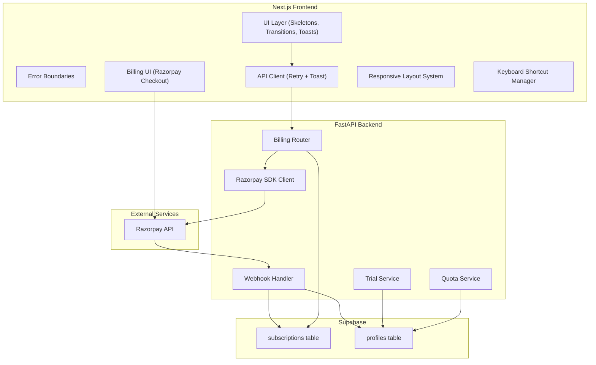

# Design Document — Phase 6 Polish

## Overview

Phase 6 transforms OmniLaunch from a functional prototype into a production-ready, monetizable product. This phase adds UI polish (loading skeletons, page transitions), comprehensive error handling (error boundaries, toast notifications, retry logic), user-facing rate limit feedback, Razorpay billing integration (replacing Stripe), responsive mobile design, extended keyboard shortcuts, a free trial system, and billing history.

The design prioritizes:
- **Progressive enhancement**: Loading states and animations improve perceived performance without blocking functionality
- **Resilience**: Retry logic and error boundaries ensure transient failures don't disrupt user workflows
- **Monetization**: Razorpay integration enables subscription billing with INR pricing
- **Mobile-first responsiveness**: The dashboard adapts gracefully to mobile and tablet viewports

## Architecture



### Key Architectural Decisions

| Decision | Rationale |
|----------|-----------|
| **Razorpay over Stripe** | Target market is India; Razorpay supports INR natively, UPI, and has lower fees for Indian merchants |
| **Client-side retry in API client** | Centralizes retry logic; avoids duplicating retry in every component |
| **Zustand toast store** | Lightweight, no context provider needed; toasts are global state |
| **framer-motion for animations** | Already in the project; provides layout animations and AnimatePresence for exit transitions |
| **CSS media queries for responsive** | Tailwind breakpoints are simpler and more performant than JS-based responsive detection for layout |
| **Lazy-load Razorpay SDK** | Reduces initial bundle size; checkout.js is only needed when user initiates payment |
| **Webhook signature verification** | Ensures billing state changes only come from Razorpay, not spoofed requests |

## Components and Interfaces

### Frontend Components

#### 1. Skeleton Components (`components/ui/Skeleton.tsx`)

A reusable `Skeleton` component with shimmer animation via Tailwind CSS `animate-pulse` and a custom shimmer gradient. Page-specific skeleton layouts compose this primitive:

- `DashboardSkeleton` — mimics StatCard grid + LaunchRow list + QuickActionCard
- `BundlesSkeleton` — mimics bundle card grid
- `VoiceLabSkeleton` — mimics voice profile cards
- `LaunchSkeleton` — mimics platform tabs area

#### 2. Page Transition Wrapper (`components/ui/PageTransition.tsx`)

Wraps dashboard page content with `framer-motion`'s `motion.div` using `AnimatePresence` and `key={pathname}` for route-based transitions. Animation: fade + translateY(8px) over 200ms with `ease-out`.

#### 3. Error Boundary (`components/ui/ErrorBoundary.tsx`)

A React class component (required for `componentDidCatch`) that:
- Catches errors in its subtree
- Renders a fallback UI with error message + retry button
- Logs error + componentStack to `console.error`
- Exposes `resetErrorBoundary()` to re-render children

Two variants:
- `PageErrorBoundary` — wraps each dashboard page, shows inline fallback
- `RootErrorBoundary` — wraps the entire app, shows full-page fallback with reload link

#### 4. Toast System (`components/ui/Toast.tsx` + `stores/toastStore.ts`)

**Store** (`toastStore.ts`):
```typescript
interface Toast {
  id: string;
  type: "success" | "error" | "warning";
  message: string;
  duration: number; // ms
  action?: { label: string; onClick: () => void };
}

interface ToastState {
  toasts: Toast[];
  addToast: (toast: Omit<Toast, "id">) => void;
  removeToast: (id: string) => void;
}
```

**Component** (`ToastContainer.tsx`): Fixed position top-right, renders toast stack with enter/exit animations via `AnimatePresence`. Auto-dismiss via `setTimeout` based on `duration`.

#### 5. Enhanced API Client (`lib/api.ts`)

Extends the existing `ApiClient` with:
- **Retry logic**: On 5xx or network error, retry up to 3 times with exponential backoff (500ms, 1000ms, 2000ms)
- **No retry for 4xx** (except 429 which gets special handling)
- **Toast integration**: Automatically shows error toasts on failure, success toasts on mutations
- **Rate limit handling**: On 429, parses `Retry-After` header and shows toast with reset time

```typescript
private async requestWithRetry<T>(
  path: string,
  options: RequestInit,
  config: { retries?: number; isMutation?: boolean }
): Promise<T>
```

#### 6. Quota Display (`components/dashboard/QuotaDisplay.tsx`)

Shows `launches_remaining / launches_per_month` in the sidebar. Includes:
- Progress bar visualization
- Warning state when quota is low (≤1 for Free, ≤5 for Pro)
- "Upgrade" link when quota is exhausted
- Trial badge showing "X days left in trial"

#### 7. Billing Components (`components/billing/`)

- `PlanSelector.tsx` — Plan comparison cards with pricing (₹499/mo Pro, ₹1,499/mo Team)
- `CheckoutButton.tsx` — Triggers Razorpay checkout; lazy-loads SDK
- `SubscriptionCard.tsx` — Current plan display with change/cancel actions
- `BillingHistory.tsx` — Table of past payments with receipt download links
- `TrialBanner.tsx` — Prominent upgrade banner when trial < 3 days remaining

#### 8. Responsive Layout Updates

- `Sidebar.tsx` — Adds mobile overlay mode with backdrop at ≤768px
- `Header.tsx` — Compact mode at ≤768px (hamburger + title + avatar)
- `DashboardLayout` — Responsive padding (32px → 16px at mobile)
- Grid components use Tailwind responsive classes (`grid-cols-1 md:grid-cols-2 lg:grid-cols-4`)

#### 9. Keyboard Shortcut Manager (`lib/useKeyboardShortcuts.ts`)

A custom hook that manages a stack of escape handlers. Components register/unregister their escape handler on mount/unmount. The topmost handler fires on Escape press.

```typescript
function useEscapeHandler(handler: () => void, active: boolean): void
```

### Backend Components

#### 1. Billing Router (`routers/billing.py`)

Endpoints:
- `POST /api/v1/billing/create-subscription` — Creates Razorpay subscription, returns subscription ID
- `POST /api/v1/billing/verify-payment` — Verifies signature, activates subscription
- `POST /api/v1/billing/webhook` — Processes Razorpay webhook events (no auth, signature-verified)
- `GET /api/v1/billing/subscription` — Returns current subscription details
- `POST /api/v1/billing/cancel` — Cancels active subscription
- `GET /api/v1/billing/history` — Returns payment history

#### 2. Razorpay Service (`services/razorpay_service.py`)

Wraps the `razorpay` Python SDK:
- `create_subscription(plan_id: str, customer_email: str) -> dict`
- `verify_payment_signature(payment_id: str, subscription_id: str, signature: str) -> bool`
- `verify_webhook_signature(body: bytes, signature: str) -> bool`
- `cancel_subscription(subscription_id: str) -> dict`
- `fetch_payments(customer_id: str) -> list[dict]`

Signature verification uses HMAC-SHA256: `hmac.compare_digest(expected, provided)`.

#### 3. Trial Service (`services/trial_service.py`)

- `assign_trial(user_id: str)` — Sets `launches_remaining=10`, `trial_ends_at=now()+14d`
- `check_trial_expiry(user_id: str) -> bool` — Returns True if trial has expired
- `expire_trial(user_id: str)` — Resets to Free plan (3 launches)

#### 4. Updated Config (`config.py`)

Replaces Stripe fields with:
```python
razorpay_key_id: str = ""
razorpay_key_secret: str = ""
razorpay_webhook_secret: str = ""
razorpay_plan_id_pro_monthly: str = ""
razorpay_plan_id_pro_yearly: str = ""
razorpay_plan_id_team_monthly: str = ""
razorpay_plan_id_team_yearly: str = ""
```

## Data Models

### Database Schema Changes (Migration 003)

```sql
-- Rename Stripe columns to Razorpay
ALTER TABLE public.subscriptions
  RENAME COLUMN stripe_customer_id TO razorpay_customer_id;

ALTER TABLE public.subscriptions
  RENAME COLUMN stripe_subscription_id TO razorpay_subscription_id;

-- Add Razorpay plan ID column
ALTER TABLE public.subscriptions
  ADD COLUMN razorpay_plan_id TEXT;

-- Add trial support to profiles
ALTER TABLE public.profiles
  ADD COLUMN trial_ends_at TIMESTAMPTZ,
  ADD COLUMN is_trial BOOLEAN DEFAULT false;

-- Add billing history cache (optional, for faster reads)
CREATE TABLE public.billing_events (
    id UUID PRIMARY KEY DEFAULT gen_random_uuid(),
    user_id UUID REFERENCES public.profiles(id) ON DELETE CASCADE,
    event_type TEXT NOT NULL,
    razorpay_payment_id TEXT,
    razorpay_subscription_id TEXT,
    amount_paise INT,
    currency TEXT DEFAULT 'INR',
    status TEXT,
    receipt_url TEXT,
    created_at TIMESTAMPTZ DEFAULT now()
);

CREATE INDEX idx_billing_events_user ON public.billing_events(user_id);
ALTER TABLE public.billing_events ENABLE ROW LEVEL SECURITY;
CREATE POLICY "Users read own billing events"
    ON public.billing_events FOR SELECT
    USING (auth.uid() = user_id);
```

### Updated TypeScript Types

```typescript
// Subscription details
interface Subscription {
  id: string;
  plan: "free" | "pro" | "team";
  status: "active" | "past_due" | "canceled" | "trialing";
  razorpay_subscription_id: string | null;
  current_period_end: string | null;
  launches_per_month: number;
}

// Billing history entry
interface BillingEvent {
  id: string;
  event_type: string;
  amount_paise: number;
  currency: string;
  status: string;
  receipt_url: string | null;
  created_at: string;
}

// Trial info (added to UserProfile)
interface UserProfile {
  // ... existing fields
  trial_ends_at: string | null;
  is_trial: boolean;
}

// Toast
interface Toast {
  id: string;
  type: "success" | "error" | "warning";
  message: string;
  duration: number;
  action?: { label: string; onClick: () => void };
}
```

### Updated Pydantic Schemas

```python
class CreateSubscriptionRequest(BaseModel):
    plan: str = Field(description="'pro_monthly', 'pro_yearly', 'team_monthly', or 'team_yearly'")

class CreateSubscriptionResponse(BaseModel):
    subscription_id: str
    razorpay_key_id: str  # needed by frontend for checkout

class VerifyPaymentRequest(BaseModel):
    razorpay_payment_id: str
    razorpay_subscription_id: str
    razorpay_signature: str

class SubscriptionDetailResponse(BaseModel):
    id: str
    plan: str
    status: str
    razorpay_subscription_id: str | None
    current_period_end: str | None
    launches_per_month: int
    launches_used: int

class BillingEventResponse(BaseModel):
    id: str
    event_type: str
    amount_paise: int
    currency: str
    status: str
    receipt_url: str | None
    created_at: str

class BillingHistoryResponse(BaseModel):
    events: list[BillingEventResponse]
```

## Correctness Properties

*A property is a characteristic or behavior that should hold true across all valid executions of a system — essentially, a formal statement about what the system should do. Properties serve as the bridge between human-readable specifications and machine-verifiable correctness guarantees.*

### Property 1: Retry policy is determined by HTTP status code class

*For any* HTTP error response, if the status code is in the 5xx range (500-599) or is a network error, the API client SHALL retry the request up to 3 times with exponential backoff (500ms, 1000ms, 2000ms). *For any* HTTP error response with a 4xx status code (400-499, excluding 429), the API client SHALL NOT retry and SHALL immediately surface the error.

**Validates: Requirements 5.1, 5.2**

### Property 2: Quota warning thresholds are plan-dependent

*For any* combination of user plan (free, pro, team) and remaining launch quota value, the quota warning indicator SHALL be displayed if and only if: (plan is "free" AND quota ≤ 1) OR (plan is "pro" AND quota ≤ 5). Team plan users SHALL never see a quota warning regardless of quota value.

**Validates: Requirements 6.4**

### Property 3: Webhook signature verification accepts valid signatures and rejects invalid ones

*For any* webhook request body and secret key, computing `HMAC-SHA256(secret, body)` and comparing it to the provided signature SHALL return true only when the signature matches exactly. Any modification to the body, signature, or secret SHALL cause verification to fail.

**Validates: Requirements 8.5, 8.6**

### Property 4: Subscription activation maps plan ID to correct tier and quota

*For any* valid `subscription.activated` webhook event containing a Razorpay plan ID, the backend SHALL map the plan ID to the correct tier (pro or team) and set the user's `launches_per_month` to the corresponding allowance (50 for pro, unlimited/999 for team).

**Validates: Requirements 8.1**

### Property 5: Subscription charge resets quota to plan allowance

*For any* valid `subscription.charged` webhook event, the backend SHALL reset the user's `launches_remaining` to their plan's `launches_per_month` value, regardless of how many launches were previously remaining.

**Validates: Requirements 8.2**

### Property 6: Plan transition timing follows upgrade/downgrade rules

*For any* plan change request, if the new plan has a higher tier than the current plan (upgrade: free→pro, free→team, pro→team), the change SHALL apply at the start of the next billing cycle. If the new plan has a lower tier (downgrade: team→pro, team→free, pro→free), the change SHALL apply at the end of the current billing period.

**Validates: Requirements 9.3**

### Property 7: Trial assignment gives correct quota and duration

*For any* newly registered user, the backend SHALL assign exactly 10 launches and set `trial_ends_at` to exactly 14 days from the registration timestamp. The `is_trial` flag SHALL be set to true.

**Validates: Requirements 17.1**

### Property 8: Trial days remaining calculation

*For any* user with a `trial_ends_at` date in the future, the displayed "X days left in trial" value SHALL equal the ceiling of the difference between `trial_ends_at` and the current time, measured in days.

**Validates: Requirements 17.2**

### Property 9: Escape key closes topmost overlay

*For any* state where one or more modals/overlays are open (command palette, mobile sidebar, confirmation dialogs), pressing the Escape key SHALL close only the topmost (most recently opened) overlay without affecting others in the stack.

**Validates: Requirements 14.1, 14.2, 14.3**

### Property 10: Error toast for any API failure

*For any* API request that returns a 4xx or 5xx status code (after retries are exhausted for 5xx), the toast system SHALL display an error toast containing the error message from the response body.

**Validates: Requirements 4.1**

## Error Handling

### Frontend Error Strategy

| Error Type | Handling |
|-----------|----------|
| **Network error / 5xx** | Retry up to 3× with exponential backoff → toast with manual retry option |
| **4xx (client error)** | Immediate toast with error message; no retry |
| **429 (rate limit)** | Toast with "Rate limited. Try again in X seconds" using `Retry-After` header |
| **Runtime JS error** | Error boundary catches → fallback UI with retry button |
| **Razorpay checkout failure** | Toast: "Payment was not completed" |
| **Razorpay SDK load failure** | Toast: "Unable to load payment system. Please try again." |

### Backend Error Strategy

| Error Type | Handling |
|-----------|----------|
| **Invalid webhook signature** | Return 400, log the attempt with IP and timestamp |
| **Razorpay API failure** | Return 502 to client with "Payment service unavailable" |
| **Invalid plan ID in webhook** | Log warning, skip processing, return 200 (acknowledge receipt) |
| **Subscription not found** | Return 404 with descriptive message |
| **Trial already expired** | No-op on re-expiry; idempotent |

### Error Boundary Hierarchy

```
RootErrorBoundary (full-page fallback + reload link)
  └── DashboardLayout
        └── PageErrorBoundary (per-page, inline fallback + retry)
              └── Page Content
```

## Testing Strategy

### Unit Tests (Example-Based)

- **Skeleton components**: Render in loading state, verify correct placeholder elements
- **Error boundary**: Throw error in child, verify fallback renders with retry button
- **Toast component**: Render each variant, verify styling and auto-dismiss timing
- **Responsive layout**: Render at mobile/tablet/desktop viewports, verify layout changes
- **Billing UI**: Mock Razorpay SDK, verify checkout flow and error handling
- **Quota display**: Render with various quota/plan combinations, verify correct display

### Property-Based Tests (fast-check)

Property-based tests validate universal properties across generated inputs. Each test runs a minimum of 100 iterations.

**Library**: `fast-check` (already in devDependencies)
**Runner**: `vitest` (already configured)

Tests to implement:

1. **Retry policy** (Property 1): Generate random HTTP status codes (400-599), verify retry/no-retry behavior matches the policy
2. **Quota warning thresholds** (Property 2): Generate random (plan, quota) pairs, verify warning display logic
3. **Webhook signature verification** (Property 3): Generate random payloads and secrets, verify HMAC computation correctness
4. **Plan ID to tier mapping** (Property 4): Generate random plan IDs from the known set, verify correct tier/quota assignment
5. **Quota reset on charge** (Property 5): Generate random pre-existing quota values and plan types, verify reset to correct allowance
6. **Plan transition timing** (Property 6): Generate random (currentPlan, newPlan) pairs, verify upgrade/downgrade classification
7. **Trial assignment** (Property 7): Generate random registration timestamps, verify 10 launches and 14-day trial_ends_at
8. **Trial days calculation** (Property 8): Generate random (now, trial_ends_at) pairs where trial_ends_at > now, verify days remaining = ceil(diff)
9. **Escape closes topmost** (Property 9): Generate random overlay stack states, verify only topmost is closed
10. **Error toast on failure** (Property 10): Generate random error responses, verify toast is triggered with correct message

**Tag format**: `Feature: phase-6-polish, Property {N}: {title}`

### Integration Tests

- **Razorpay webhook endpoint**: Send mock webhook events with valid/invalid signatures
- **Billing create-subscription**: Mock Razorpay API, verify subscription creation flow
- **Billing verify-payment**: Test with valid and invalid signatures
- **Trial expiry**: Test the expiry logic with mocked time
- **Billing history endpoint**: Mock Razorpay payments API, verify response format

### Smoke Tests

- **Database migration**: Verify columns are renamed and new columns exist after migration
- **Config validation**: Verify Razorpay config fields are loaded correctly
- **Endpoint availability**: Verify all new billing endpoints return expected status codes
