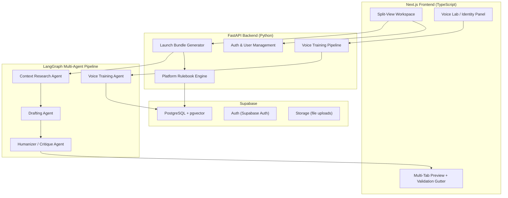
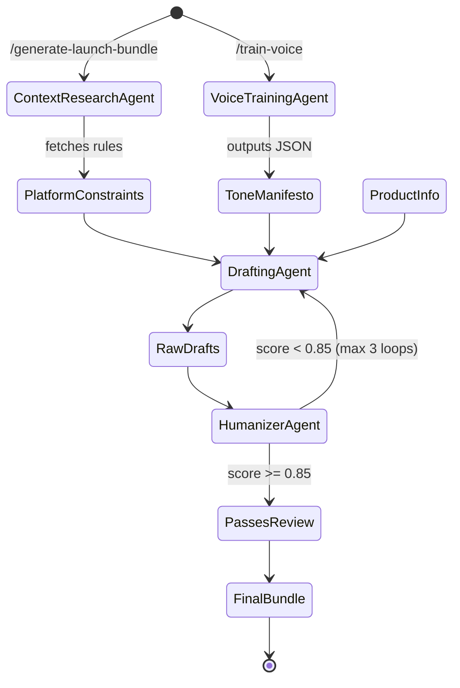
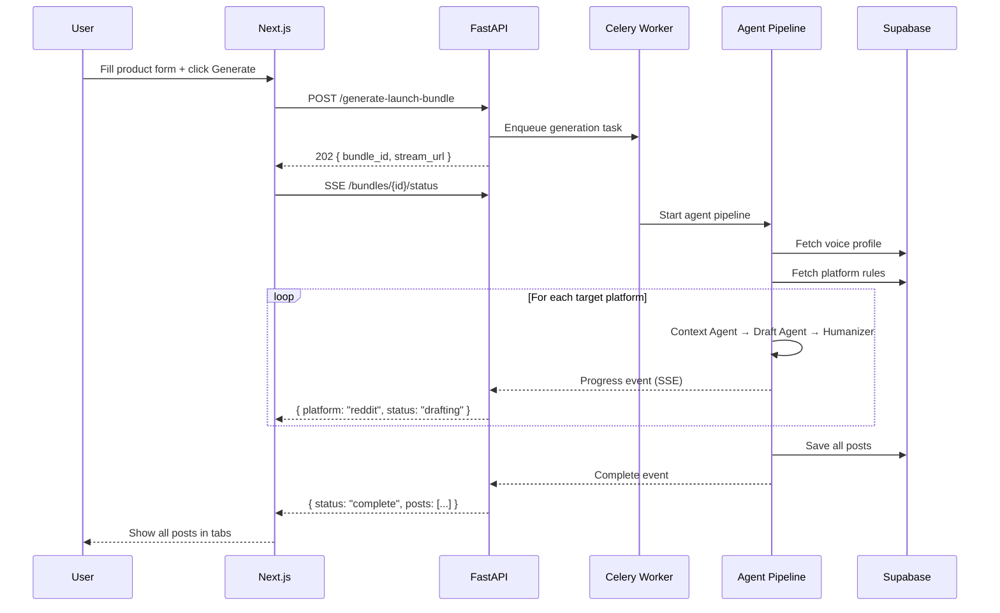

# 🚀 OmniLaunch — Full System Architecture

> **One product description → four platform-perfect, human-sounding launch posts in under 2 minutes.**

---

## 1. High-Level System Overview



---

## 2. Tech Stack

| Layer | Technology | Why |
|-------|-----------|-----|
| **Frontend** | Next.js 14 (App Router), TypeScript, Tailwind CSS | SSR, RSC, fast iteration |
| **Backend** | FastAPI, Python 3.12 | Async-native, Pydantic validation |
| **Agent Orchestration** | LangGraph | Stateful multi-agent workflows with cycles |
| **LLM Provider** | Google Gemini 2.5 Pro (primary), fallback to GPT-4o | Cost + quality balance |
| **Database** | Supabase (PostgreSQL + pgvector) | Vector search for voice profiles, RLS |
| **Auth** | Supabase Auth + JWT | Social logins, row-level security |
| **Queue/Jobs** | Celery + Redis | Long-running agent tasks |
| **Deployment** | Vercel (frontend), Railway/Fly.io (backend) | Zero-config scaling |

---

## 3. Database Schema (Supabase / PostgreSQL)

```sql
-- Users table (extends Supabase auth.users)
CREATE TABLE public.profiles (
    id UUID PRIMARY KEY REFERENCES auth.users(id),
    display_name TEXT,
    email TEXT UNIQUE NOT NULL,
    plan TEXT DEFAULT 'free', -- free | pro | team
    launches_remaining INT DEFAULT 3,
    created_at TIMESTAMPTZ DEFAULT now()
);

-- Voice Profiles (the "Identity Layer")
CREATE TABLE public.voice_profiles (
    id UUID PRIMARY KEY DEFAULT gen_random_uuid(),
    user_id UUID REFERENCES public.profiles(id) ON DELETE CASCADE,
    name TEXT DEFAULT 'Default Voice',
    tone_manifesto JSONB NOT NULL,
    -- Embedding of the user's writing style for similarity search
    style_embedding VECTOR(768),
    source_samples JSONB, -- array of { url | text, platform, engagement_score }
    created_at TIMESTAMPTZ DEFAULT now(),
    updated_at TIMESTAMPTZ DEFAULT now()
);

-- Platform Rulebooks
CREATE TABLE public.platform_rules (
    id UUID PRIMARY KEY DEFAULT gen_random_uuid(),
    platform TEXT NOT NULL,        -- "reddit", "hackernews", "producthunt", "indiehackers"
    sub_target TEXT,               -- "r/webdev", "r/SaaS", null for HN
    prefix TEXT,                   -- "Show HN:", "[Showcase]"
    forbidden_words TEXT[],
    required_elements TEXT[],      -- e.g., ["flair:Showcase", "link_in_url_field"]
    max_title_length INT,
    max_body_length INT,
    formatting_rules JSONB,        -- markdown allowed?, emoji policy, etc.
    schedule_notes TEXT,            -- "Showcase flair only on Tuesdays"
    updated_at TIMESTAMPTZ DEFAULT now()
);

-- Launch Bundles (generated output)
CREATE TABLE public.launch_bundles (
    id UUID PRIMARY KEY DEFAULT gen_random_uuid(),
    user_id UUID REFERENCES public.profiles(id) ON DELETE CASCADE,
    voice_profile_id UUID REFERENCES public.voice_profiles(id),
    product_name TEXT NOT NULL,
    product_description TEXT NOT NULL,
    target_audience TEXT,
    product_url TEXT,
    status TEXT DEFAULT 'pending', -- pending | generating | complete | failed
    created_at TIMESTAMPTZ DEFAULT now()
);

-- Individual Generated Posts
CREATE TABLE public.generated_posts (
    id UUID PRIMARY KEY DEFAULT gen_random_uuid(),
    bundle_id UUID REFERENCES public.launch_bundles(id) ON DELETE CASCADE,
    platform TEXT NOT NULL,
    sub_target TEXT,
    title TEXT,
    body TEXT,
    voice_match_score FLOAT,      -- 0.0 - 1.0
    rule_violations JSONB,         -- [{ rule, severity, message }]
    rule_pass_count INT,
    rule_total_count INT,
    revision INT DEFAULT 1,
    created_at TIMESTAMPTZ DEFAULT now()
);
```

---

## 4. Multi-Agent Pipeline (LangGraph)



### Agent 1: Voice Training Agent

**Trigger:** `POST /api/v1/train-voice`

**Input:**
```json
{
  "samples": [
    { "type": "url", "value": "https://reddit.com/r/SaaS/comments/..." },
    { "type": "text", "value": "Hey folks, I built a thing..." }
  ]
}
```

**Process:**
1. Scrape/parse each URL (Playwright for JS-rendered pages, httpx for static)
2. Feed all samples to LLM with analysis prompt
3. Generate style embedding via `text-embedding-004`
4. Store in `voice_profiles`

**Output — Tone Manifesto (JSON):**
```json
{
  "voice_id": "vp_abc123",
  "analysis": {
    "sentence_structure": "short_punchy",
    "avg_sentence_length": 12,
    "vocabulary_level": "accessible_technical",
    "technicality_score": 0.7,
    "emoji_usage": "minimal",          // none | minimal | moderate | heavy
    "emoji_examples": ["🚀", "👋"],
    "hashtag_usage": "none",
    "humor_level": "dry_wit",
    "formality": 0.3,                  // 0 = very casual, 1 = very formal
    "first_person_preference": "I_over_we",
    "call_to_action_style": "soft_ask",
    "forbidden_patterns": ["In today's fast-paced world", "game-changer"],
    "signature_phrases": ["honest question:", "built this because"],
    "paragraph_length": "2-3 sentences",
    "opening_style": "direct_hook",     // direct_hook | story | question
    "closing_style": "soft_cta"
  },
  "sample_count": 5,
  "confidence": 0.89
}
```

### Agent 2: Context Research Agent

**Trigger:** Called internally per platform during bundle generation

**Input:** `{ "platform": "reddit", "sub_target": "r/webdev" }`

**Process:**
1. Query `platform_rules` table for the target
2. If stale (>7 days), optionally re-scrape subreddit sidebar via Reddit API
3. Merge static rules with dynamic context (day-of-week flair rules, etc.)

**Output — Platform Constraints:**
```json
{
  "platform": "reddit",
  "sub_target": "r/webdev",
  "constraints": {
    "prefix": null,
    "required_flair": "Showcase",
    "flair_schedule": "Tuesdays and Saturdays only",
    "max_title_length": 300,
    "max_body_length": 40000,
    "forbidden_words": ["revolutionary", "best ever"],
    "required_elements": ["include_tech_stack", "link_to_demo"],
    "formatting": { "markdown": true, "images": false },
    "tone_guidance": "Be humble, show what you learned, ask for feedback"
  }
}
```

### Agent 3: Drafting Agent

**Input:** Tone Manifesto + Platform Constraints + Product Info

**System Prompt Core:**
```
You are writing as this specific person. Here is their voice profile: {tone_manifesto}.
You are posting to {platform}/{sub_target}. Here are the rules: {constraints}.
Product info: {product_description}.

CRITICAL RULES:
- Match the user's sentence structure and vocabulary level exactly
- Never use words from the forbidden list
- Stay within character limits
- Include all required elements
- Do NOT sound like an AI. No "dive into", "leverage", "in today's world".
```

**Output:** Raw draft per platform (title + body)

### Agent 4: Humanizer / Critique Agent

**Input:** Raw draft + Tone Manifesto + Platform Constraints

**Process:**
1. **AI-ism Detection** — Scans for 50+ known AI patterns and replaces them
2. **Voice Match Scoring** — Compares draft embedding against user's style_embedding (cosine similarity)
3. **Rule Validation** — Checks every constraint from the rulebook
4. If `voice_match_score < 0.85` → sends back to Drafting Agent (max 3 iterations)

**Output — Validated Post:**
```json
{
  "platform": "reddit",
  "sub_target": "r/webdev",
  "title": "I built a tool that turns one product description into launch posts for 4 platforms",
  "body": "Hey r/webdev 👋\n\nI kept losing hours reformatting...",
  "validation": {
    "voice_match_score": 0.92,
    "rule_checks": [
      { "rule": "flair_required", "status": "pass", "detail": "Showcase flair attached" },
      { "rule": "forbidden_words", "status": "pass", "detail": "No forbidden words found" },
      { "rule": "title_length", "status": "pass", "detail": "82/300 characters" },
      { "rule": "tone_match", "status": "warning", "detail": "Slightly more formal than usual" }
    ],
    "ai_isms_removed": ["leverage → use", "utilize → use", "streamline → speed up"],
    "revision": 2
  }
}
```

---

## 5. API Endpoints (FastAPI)

```python
# ── Auth ──────────────────────────────────────────
POST   /api/v1/auth/signup
POST   /api/v1/auth/login
POST   /api/v1/auth/refresh
GET    /api/v1/auth/me

# ── Voice Profiles ────────────────────────────────
POST   /api/v1/train-voice            # Analyze samples → create voice profile
GET    /api/v1/voice-profiles          # List user's voice profiles
GET    /api/v1/voice-profiles/{id}     # Get specific profile + manifesto
PUT    /api/v1/voice-profiles/{id}     # Update with new samples
DELETE /api/v1/voice-profiles/{id}

# ── Platform Rules ────────────────────────────────
GET    /api/v1/platforms               # List all supported platforms
GET    /api/v1/platforms/{platform}/rules?sub_target=r/webdev

# ── Launch Bundles ────────────────────────────────
POST   /api/v1/generate-launch-bundle  # Main generation endpoint
GET    /api/v1/bundles                 # List user's bundles
GET    /api/v1/bundles/{id}            # Get bundle + all generated posts
GET    /api/v1/bundles/{id}/status     # Poll generation progress (SSE)

# ── Posts ─────────────────────────────────────────
GET    /api/v1/posts/{id}              # Get single post
PUT    /api/v1/posts/{id}              # Manual edit + re-validate
POST   /api/v1/posts/{id}/regenerate   # Re-run agents for one post
POST   /api/v1/posts/{id}/copy         # Track copy-to-clipboard events
```

### Key Request/Response Examples

**`POST /api/v1/generate-launch-bundle`**

Request:
```json
{
  "voice_profile_id": "vp_abc123",
  "product": {
    "name": "OmniLaunch",
    "description": "A dashboard that turns one product description into platform-perfect launch posts using AI voice cloning.",
    "url": "https://omnilaunch.dev",
    "target_audience": "Indie hackers and SaaS founders",
    "tech_stack": ["Next.js", "FastAPI", "LangGraph"]
  },
  "targets": [
    { "platform": "reddit", "sub_target": "r/SaaS" },
    { "platform": "reddit", "sub_target": "r/webdev" },
    { "platform": "hackernews" },
    { "platform": "producthunt" }
  ]
}
```

Response (immediate — generation is async):
```json
{
  "bundle_id": "bundle_xyz789",
  "status": "generating",
  "estimated_time_seconds": 45,
  "stream_url": "/api/v1/bundles/bundle_xyz789/status"
}
```

**`GET /api/v1/bundles/{id}` (after completion)**

```json
{
  "bundle_id": "bundle_xyz789",
  "status": "complete",
  "product_name": "OmniLaunch",
  "posts": [
    {
      "id": "post_001",
      "platform": "hackernews",
      "title": "Show HN: OmniLaunch – turns one description into 4 platform-ready launch posts",
      "body": null,
      "voice_match_score": 0.94,
      "validation_summary": { "passed": 5, "warnings": 1, "failed": 0 },
      "rule_checks": [ "..." ]
    },
    {
      "id": "post_002",
      "platform": "reddit",
      "sub_target": "r/SaaS",
      "title": "I built a tool that writes your launch posts in YOUR voice",
      "body": "Hey r/SaaS 👋\n\nI spent the last 3 months...",
      "voice_match_score": 0.91,
      "validation_summary": { "passed": 7, "warnings": 0, "failed": 0 },
      "rule_checks": [ "..." ]
    }
  ],
  "created_at": "2026-05-12T12:00:00Z"
}
```

---

## 6. Frontend Architecture (Next.js)

### Page Structure

```
app/
├── layout.tsx              # Root layout, global nav, auth provider
├── page.tsx                # Landing / marketing page
├── (auth)/
│   ├── login/page.tsx
│   └── signup/page.tsx
├── (dashboard)/
│   ├── layout.tsx          # Dashboard shell (sidebar + topbar)
│   ├── page.tsx            # Dashboard home — recent bundles
│   ├── voice-lab/
│   │   └── page.tsx        # Voice training UI
│   ├── launch/
│   │   └── page.tsx        # ★ Split-View Workspace (main screen)
│   ├── bundles/
│   │   ├── page.tsx        # Bundle history
│   │   └── [id]/page.tsx   # Bundle detail view
│   └── settings/
│       └── page.tsx
```

### Split-View Workspace Layout

```
┌──────────────────────────────────────────────────────────────────────┐
│  🚀 OmniLaunch                        [Voice: Casual Tech] [⚙️]    │
├─────────────────────────┬────────────────────────────────────────────┤
│                         │  [Reddit] [HN] [PH] [IndieHackers]        │
│  📦 Product Info        │ ┌────────────────────────────────────────┐ │
│                         │ │                                        │ │
│  Name: ____________     │ │  Show HN: OmniLaunch – turns one      │ │
│                         │ │  description into 4 platform-ready     │ │
│  Description:           │ │  launch posts                          │ │
│  ┌──────────────────┐   │ │                                        │ │
│  │                  │   │ │  Hey HN, I built OmniLaunch because    │ │
│  │                  │   │ │  I was tired of spending 2 hours...    │ │
│  └──────────────────┘   │ │                                        │ │
│                         │ └────────────────────────────────────────┘ │
│  URL: ______________    │                                            │
│                         │  ── Validation Gutter ──────────────────── │
│  Audience: __________   │  ✅ Voice Match: 94%                      │
│                         │  ✅ Title: 68/80 chars                    │
│  Platforms:             │  ✅ No forbidden words                    │
│  ☑ Reddit  ☑ HN        │  ⚠️  Slightly more formal than usual      │
│  ☑ PH     ☑ IH         │  ✅ Link in URL field                    │
│                         │                                            │
│  [🚀 Generate Bundle]  │  [📋 Copy] [✏️ Edit] [🔄 Regenerate]      │
├─────────────────────────┴────────────────────────────────────────────┤
│  Powered by your voice profile "Casual Tech Writer" (5 samples)     │
└──────────────────────────────────────────────────────────────────────┘
```

### Key UI Components

| Component | Description |
|-----------|------------|
| `VoiceLab` | Upload samples (URLs/text), view Tone Manifesto, see confidence score |
| `ProductForm` | Left panel — product name, description, URL, audience, platform checkboxes |
| `PostPreview` | Right panel — tabbed view of generated posts with syntax-highlighted formatting |
| `ValidationGutter` | Sidebar showing pass/warn/fail badges for each rule |
| `VoiceMatchMeter` | Animated circular gauge showing voice similarity percentage |
| `BundleTimeline` | Dashboard home — cards showing past launches with status |

---

## 7. Real-Time Generation Flow (SSE)



---

## 8. Directory Structure

```
OmniLaunch/
├── frontend/                      # Next.js app
│   ├── package.json
│   ├── next.config.ts
│   ├── tailwind.config.ts
│   ├── src/
│   │   ├── app/                   # App Router pages (see §6)
│   │   ├── components/
│   │   │   ├── ui/                # Shadcn/Radix primitives
│   │   │   ├── voice-lab/
│   │   │   ├── launch/
│   │   │   │   ├── ProductForm.tsx
│   │   │   │   ├── PostPreview.tsx
│   │   │   │   ├── ValidationGutter.tsx
│   │   │   │   └── PlatformTabs.tsx
│   │   │   └── shared/
│   │   ├── lib/
│   │   │   ├── api.ts             # Typed API client
│   │   │   ├── supabase.ts        # Supabase client init
│   │   │   └── hooks/
│   │   ├── stores/                # Zustand stores
│   │   └── types/                 # Shared TypeScript types
│   └── public/
│
├── backend/                       # FastAPI app
│   ├── pyproject.toml
│   ├── app/
│   │   ├── main.py                # FastAPI app + CORS + lifespan
│   │   ├── config.py              # Pydantic Settings
│   │   ├── routers/
│   │   │   ├── auth.py
│   │   │   ├── voice.py           # /train-voice, /voice-profiles
│   │   │   ├── platforms.py       # /platforms
│   │   │   ├── bundles.py         # /generate-launch-bundle, /bundles
│   │   │   └── posts.py           # /posts
│   │   ├── agents/
│   │   │   ├── graph.py           # LangGraph state machine
│   │   │   ├── voice_trainer.py   # Voice Training Agent
│   │   │   ├── context_researcher.py
│   │   │   ├── drafter.py
│   │   │   └── humanizer.py
│   │   ├── models/                # Pydantic models
│   │   ├── services/              # Business logic
│   │   └── db/                    # Supabase client + queries
│   └── tests/
│
├── supabase/
│   ├── migrations/                # SQL migration files
│   └── seed.sql                   # Platform rules seed data
│
├── docker-compose.yml
└── README.md
```

---

## 9. Platform Rulebook Seed Data

```json
[
  {
    "platform": "hackernews",
    "sub_target": null,
    "prefix": "Show HN:",
    "forbidden_words": ["revolutionary", "game-changer", "best", "amazing", "incredible"],
    "max_title_length": 80,
    "max_body_length": null,
    "formatting_rules": {
      "markdown": false,
      "links_in_text": false,
      "tone": "Show what you built, be technical, ask for feedback"
    }
  },
  {
    "platform": "producthunt",
    "sub_target": null,
    "prefix": null,
    "forbidden_words": [],
    "max_title_length": 60,
    "max_body_length": 260,
    "formatting_rules": {
      "tagline_max": 60,
      "description_max": 260,
      "requires_media": true,
      "tone": "Exciting but concise, emoji-friendly"
    }
  },
  {
    "platform": "reddit",
    "sub_target": "r/SaaS",
    "prefix": null,
    "forbidden_words": ["best tool ever", "you need this"],
    "required_elements": ["flair:Showcase"],
    "max_title_length": 300,
    "formatting_rules": {
      "markdown": true,
      "flair_schedule": "Showcase flair on Tuesdays and Saturdays",
      "tone": "Be authentic, share your journey, ask for feedback"
    }
  },
  {
    "platform": "indiehackers",
    "sub_target": null,
    "prefix": null,
    "forbidden_words": [],
    "max_title_length": 100,
    "formatting_rules": {
      "markdown": true,
      "tone": "Founder-to-founder, transparent about metrics"
    }
  }
]
```

---

## 10. Expected Final Output (What the User Sees)

When a user clicks **"Generate Bundle"**, they receive a complete launch kit:

### Hacker News Post
> **Show HN: OmniLaunch – turns one description into 4 platform-ready launch posts**
>
> *(Link field: https://omnilaunch.dev)*

### Reddit r/SaaS Post (Flair: Showcase)
> **I built a tool that writes your launch posts in YOUR voice**
>
> Hey r/SaaS 👋
>
> I spent the last 3 months building launch posts for my side projects and realized I was losing 2+ hours every time reformatting the same thing for Reddit, HN, and Product Hunt.
>
> So I built OmniLaunch. You paste your product description once, it learns how you write, and spits out compliant posts for each platform.
>
> The key thing: it's not generic AI slop. You feed it your past posts and it matches your tone. Mine's casual and a bit sarcastic — yours might be different.
>
> **Tech stack:** Next.js, FastAPI, LangGraph
>
> Would love feedback. What platforms do you usually launch on?

### Product Hunt
> **Tagline (58/60 chars):** Turn one description into 4 platform-perfect launch posts
>
> **Description:** Stop spending hours reformatting. OmniLaunch learns your writing voice and generates compliant posts for Reddit, HN, Product Hunt, and IndieHackers — in 2 minutes.

### IndieHackers
> **I just launched OmniLaunch — here's what I learned about platform compliance**
>
> Quick backstory: I kept getting posts removed on Reddit because I missed flair rules...

---

## 11. Implementation Phases

| Phase | Scope | Timeline |
|-------|-------|----------|
| **Phase 1** | Project scaffold, Supabase schema, auth flow, basic dashboard shell | Week 1 |
| **Phase 2** | Voice Lab — sample ingestion, Tone Manifesto generation, storage | Week 2 |
| **Phase 3** | Platform Rulebook DB + seed data, rule validation engine | Week 3 |
| **Phase 4** | LangGraph agent pipeline (all 4 agents), SSE streaming | Week 3-4 |
| **Phase 5** | Split-View UI, tabbed preview, validation gutter | Week 4-5 |
| **Phase 6** | Polish — animations, error handling, rate limiting, billing | Week 5-6 |

---

## 12. Key Design Decisions

| Decision | Rationale |
|----------|-----------|
| **LangGraph over simple chains** | Need loops (humanizer can reject and re-draft), conditional edges, and state persistence |
| **Celery for generation** | 30-60s generation time — can't block the HTTP request |
| **SSE over WebSockets** | Simpler for one-directional progress updates; no need for bidirectional communication |
| **pgvector for voice profiles** | Enables similarity search if we later add "find similar voices" or voice templates |
| **Separate Humanizer agent** | Dedicated critique loop catches AI-isms that the drafting agent misses; separation of concerns |
| **Platform rules in DB, not code** | Enables admin panel for rule updates without redeployment; users could eventually submit rule corrections |

> [!IMPORTANT]
> **Next step:** Confirm this architecture meets your requirements, then I'll scaffold the full project with working code for both frontend and backend.
